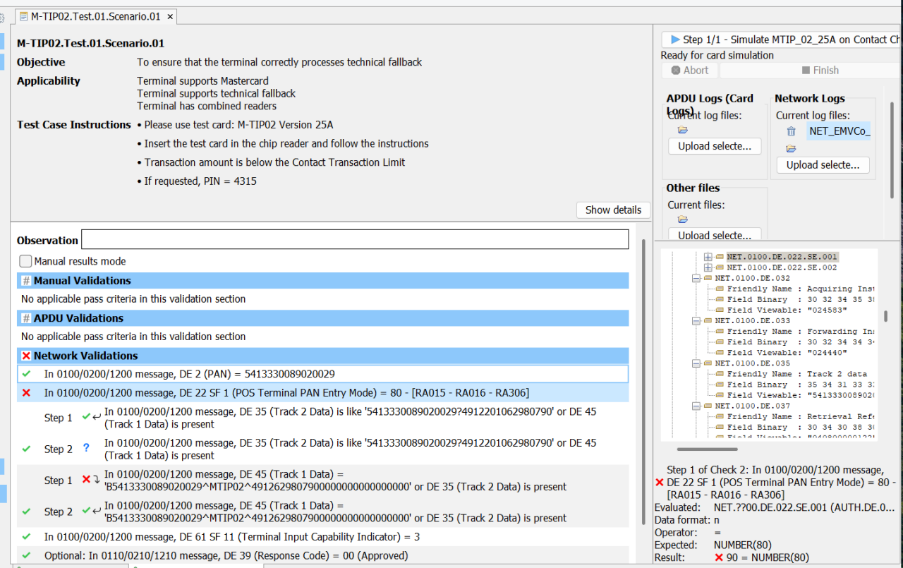

# ISO 8583 报文域全景与 POS 录入方式（DE22）/ 技术回退

> L3 主机测试校验的不止 [DE55（EMV TLV）](./ISO8583-字段55-跨卡组织要求.md)，还有**外层 ISO 8583 报文**里其余数据元（DE）的取值是否正确。本文补齐 DE55 之外的报文域：报文整体结构（MTI / Bitmap / DE）、L3 相关关键域速查，并**重点深入 DE22（POS 录入方式）与技术回退（Technical Fallback）**——这是真实 L3 测试最高发的报文层失败点之一。承接 [DE55 框架篇](./ISO8583-字段55-跨卡组织要求.md)、[DE55 逐标签实现清单](./ISO8583-DE55-逐标签实现清单.md)、[APDU/TLV 实测交易流程解读](./APDU-TLV实测交易流程解读.md)、[收单主机认证与 L3 重测触发条件](./收单主机认证与L3重测触发条件.md)、[TAC/IAC/TVR 决策逻辑](../01-基础概念/TAC-IAC-TVR决策逻辑.md)。
>
> ⚠️ 各数据元的精确码值集、长度、子域划分**随报文协议与卡组织而异**（Visa BASE I/II、Mastercard CIS/IPM、银联 8583、各收单主机手册）。本文给出业界通行框架与 Mastercard 取向，精确取值以**你对接的卡组织/收单主机报文规范最新版**为准。

---

## 一、ISO 8583 报文整体结构

一条授权/账务报文由三部分组成：

```
┌──────────┬──────────────────┬───────────────────────────┐
│   MTI    │     Bitmap       │   Data Elements (DE 1..n)  │
│ 4 位数字 │  主+辅 位图       │   按位图置位顺序排列        │
└──────────┴──────────────────┴───────────────────────────┘
```

- **MTI（Message Type Indicator）**：4 位。常见：`0100` 授权请求 / `0110` 授权响应 / `0200` 账务（消费）请求 / `0210` 响应 / `0400` 冲正请求 / `0420` 反转。本文用例截图里的 `0100/0200/1200` 即覆盖授权与账务两类，`1xxx` 是 ISO 8583:2003 版 MTI。
- **Bitmap（位图）**：主位图 64 bit 指示 DE1–DE64 是否存在；若 DE1 置位则附辅位图，扩展到 DE65–DE128。
- **Data Elements（数据元 DE）**：每个域有固定的长度/格式定义（定长 `n12`、变长 `LLVAR`/`LLLVAR` 等）。**DE55 只是其中一个域**——[DE55 两篇文档](./ISO8583-DE55-逐标签实现清单.md)讲的是 DE55 内部的 BER-TLV；本文讲 DE55 之外的域。

> 关系图：终端 → 收单主机的报文里，**EMV 内核产出的数据**装进 DE55（TLV）；**卡片磁道/录入方式/金额/受理环境**等装进 DE2、DE22、DE35、DE45 等独立域。L3 主机测试两层都要校。

---

## 二、L3 相关关键数据元速查

> 下表聚焦 L3 / EMV 受理最常被测试脚本校验的域；并非完整 128 域清单。

| DE | 名称 | 格式 | L3 关注点 |
|----|------|------|-----------|
| **DE2** | Primary Account Number (PAN) | LLVAR n..19 | 须与卡片 `5A`/`57`(Track2) 一致；Token 交易为 DPAN |
| **DE3** | Processing Code | n6 | 子域：交易类型(00 消费/01 取现/20 退款) + 借/贷账户 |
| **DE4** | Amount, Transaction | n12 | 须与 `9F02` 一致 |
| **DE11** | System Trace Audit Number (STAN) | n6 | 流水追踪 |
| **DE12/13** | Local Time / Date | n6/n4 | 与 `9A` 交易日期协同 |
| **DE14** | Expiration Date (YYMM) | n4 | 来自卡片，须与 Track 一致 |
| **DE18** | Merchant Type (MCC) | n4 | 受理类别 |
| **DE19** | Acquiring Country Code | n3 | |
| **DE22** | **POS Entry Mode（录入方式）** | **n3 / 子域** | **本文重点**：SF1 PAN 录入(芯片/磁条/非接/**回退**)、SF2 PIN 能力 |
| **DE23** | Card Sequence Number | n3 | = `5F34` PAN Seq |
| **DE25** | POS Condition Code | n2 | 受理条件（正常/重输/分期…） |
| **DE35** | **Track 2 Data** | LLVAR z..37 | 磁条/芯片等效；含 PAN+有效期+**服务码**+自定义数据 |
| **DE38** | Authorization ID Response | an6 | 授权码（批准时） |
| **DE39** | **Response Code** | an2/n3 | `00`=批准；其余为拒绝/转介码 |
| **DE41** | Card Acceptor Terminal ID | ans8 | 终端编号(TID) |
| **DE42** | Card Acceptor ID | ans15 | 商户编号(MID) |
| **DE45** | **Track 1 Data** | LLVAR ans..76 | 含格式码(B)+PAN+持卡人名+有效期+服务码 |
| **DE48** | Additional Data – Private | LLLVAR | 卡组织/收单私有子域（很多专有指示位在这） |
| **DE49** | Transaction Currency Code | n3 | = `5F2A` |
| **DE52** | PIN Data | b8 | 在线 PIN 密文块 |
| **DE55** | ICC System Related Data | LLLVAR | **EMV BER-TLV**，见 [DE55 实现清单](./ISO8583-DE55-逐标签实现清单.md) |
| **DE61** | POS Data / Point-of-Service Data | 子域 | SF11 = Terminal Input Capability Indicator（须与 `9F33`/`9F35` 自洽） |

> **跨域一致性**是 L3 报文测试的核心思路：DE2↔`5A`/DE35、DE4↔`9F02`、DE49↔`5F2A`、DE14↔Track 有效期、DE61 SF11↔`9F33`、**DE22↔实际受理路径**。任何一处不自洽都会被脚本判失败。

---

## 三、DE22（POS Entry Mode）深入

DE22 描述「**这笔交易的卡片数据是怎么进来的**」。它通常拆成两个子域：

| 子域 | 名称 | 长度 | 含义 |
|------|------|------|------|
| **SF1** | PAN/Card Data Entry Mode | 2 位 | 卡号是手输 / 磁条 / 芯片 / 非接 / **回退** |
| **SF2** | PIN Entry Capability | 1 位 | 终端是否具备 PIN 录入能力 |

### 3.1 SF1（PAN 录入方式）通行码值

> 业界通行集合（Mastercard CIS / Visa 取向一致；精确以卡组织手册为准）：

| 码值 | 含义 | EMV 场景 |
|------|------|----------|
| `00` | 未知 / 未指定 | — |
| `01` | 手工键入 PAN（keyed） | 无卡/MO-TO |
| `02` | 磁条读取，**服务码不一定可信** | 旧式磁条 |
| `05` | **芯片(ICC)读取成功**，CVC/iCVV 可信 | 正常接触 EMV |
| `07` | **非接 EMV（M/Chip、qVSDC）自动录入** | 正常非接芯片 |
| `80` | **技术回退**：芯片卡在支持芯片的终端上**读失败后回退到磁条** | ← 本文重点 |
| `90` | **磁条整轨读取**，服务码可信（普通刷卡） | 纯磁条卡 / 误判 |
| `91` | **非接磁条（MSD/contactless magstripe）** | 非接降级为磁道 |
| `95` | 芯片读取但 CVC 可能不可信 / 芯片数据异常（Visa 取向） | 部分实现 |

> ⚠️ **编码形态务必厘清——上表是「SF1 子域取值」，不是线上整域值**：
> - **线上 DE22 通常是 SF1+SF2 拼成的 3 位 `n3`**：抓包看到的是 `071`（非接芯片+可输PIN）、`801`（回退+可输PIN）、`901`（磁条+可输PIN）、`951` 等，而非孤立的 `80`/`90`。本文按子域拆开讲是为了说清语义；落到报文时记得它和 SF2 拼接上送。FIME BTT 工具把它**按子域展示**为 `DE22 SF1 = 80`（见 §七 截图），与线上 3 位是同一回事的两种视图。
> - **部分卡组织/处理商另用 3 位独立码集**：如 emvdecoder/某些处理平台用 `051`/`071`/`901…`，其中 `901` 即"芯片→磁条回退"，与这里的 `80` 语义相同、编码不同。
> - **`80`（技术回退）属卡组织/处理商扩展值，不在 ISO 8583:1987 原始通用表内**（原始表只到 `90/91/95` 这类 PAN 录入位）；但 Visa、Mastercard、各大处理平台（如 Galileo DE022）均定义并实际上送之——本文 §七 的 Mastercard M-TIP 实测即要求 `80`。
> - 另有 `79` = 混合终端的另一类 fallback（联机终端 fallback 发送失败 / 脱机终端读芯片失败转磁条），见下方参考资料。
>
> **精确码集与拼接规则以你对接的卡组织/收单主机报文规范最新版为准**（详见文末[参考资料](#参考资料)）。

### 3.2 五个最易混淆的码值

```
05  芯片读成功            ┐
07  非接芯片读成功         ├─ 正常 EMV，发卡行按芯片风控
                          ┘
80  芯片读失败→磁条回退    ← 必须显式标 80（technical fallback）
90  纯磁条整轨刷卡         ← 非芯片卡才对；芯片卡标 90 = 错
91  非接降级为磁条 (MSD)   ← 非接侧降级，不是接触回退
```

**`80` 与 `90` 的区别是 L3 的硬要求，不是可选风格**：

- `80` 告诉发卡行：「这**本是芯片卡**，芯片读不了我才退到磁条的」→ 发卡行走 **fallback 专用风控**（计数、限频、可能拒绝），**责任转移（liability shift）** 也按 fallback 规则判（通常仍偏向收单/终端，但与持卡人直接刷磁条不同）。
- `90` 告诉发卡行：「持卡人就是刷了磁条」→ 对一张芯片卡（Track 服务码=`2xx`/`6xx`，见 §五）这是**自相矛盾**的：服务码说"请用芯片"，录入方式却说"普通刷磁条"。发卡行通常**直接拒绝或风控告警**。

### 3.3 SF2（PIN 录入能力）取值

> SF1 讲"卡数据怎么进来"，**SF2 讲"这台终端有没有/能不能让持卡人输 PIN"**——是终端的*固有能力 + 当下状态*，**不是**"本笔交易实际做没做 PIN"。CVM 实际是否 Online PIN 由 DE52（PIN 密文块）是否在场、`9F34`(CVM Results) 体现；SF2 描述的是能力。L3 脚本会单独校 SF2，且要求它与终端能力(`9F33` 第三字节 CVM Capability)、DE61 SF11 自洽。

| 码值 | 含义 | 典型场景 |
|------|------|----------|
| `0` | 能力未知 / 未指定 | 不应在受测终端出现 |
| `1` | **具备 PIN 录入能力**（有可用 PIN Pad） | 绝大多数 attended/POS 终端 |
| `2` | **不具备 PIN 录入能力**（无 PIN Pad，或仅签名/No CVM） | 纯非接小额、无键盘自助设备 |
| `8` | **本具备 PIN 能力，但 PIN Pad 当前不可用/故障（inoperative / down）** | 键盘损坏、临时禁用 |

> ⚠️ 各卡组织对 SF2 的码集略有差异（Visa BASE I、Mastercard CIS 基本是 `0/1/2/8` 四值；部分主机手册另定 `3`/`9` 等保留位）。**精确以你对接的卡组织/收单主机报文规范为准。**

**SF2 与终端能力的一致性（L3 高发校验点）**：

```
SF2 = 1 (有 PIN 能力)
   ↳ 须与 9F33 byte3 CVM Capability 中的 "Plaintext/Enciphered PIN for online" bit 自洽
   ↳ 若实际本笔走了 Online PIN：DE52 必须在场、9F34 指示 Online PIN
SF2 = 2 (无 PIN 能力)
   ↳ 终端 9F33 不应声明 online PIN 能力；CVM 应落到签名 / No CVM
   ↳ 仍上送 DE52 = 矛盾，脚本判失败
SF2 = 8 (PIN Pad 故障)
   ↳ 本可输 PIN 但设备故障 → 发卡行据此走降级 CVM 风控（类比 SF1 的 fallback 语义）
```

- **常见 bug**：终端声明支持 Online PIN（`9F33` 置位）但 SF2 误送 `2`，或反之；以及非接 No-CVM 小额交易仍把 SF2 标 `1` 却不带 DE52——能力位与实际 CVM 路径不自洽。
- SF2 与 CVM 决策的上游逻辑（CVM List、`9F34` 结果、No CVM 最大化）见 [接触与非接 CVM 详解](../01-基础概念/接触与非接CVM详解.md)、[EMV 免密免签判断流程](../01-基础概念/EMV免密免签判断流程.md)。

---

## 四、技术回退（Technical Fallback）

### 4.1 定义与触发链

技术回退 = 终端**先尝试芯片交易、芯片失败、再回退到磁条**完成交易。完整链路：

```
插卡 → SELECT/GPO/READ RECORD/GENERATE AC 其一失败（芯片错误、卡损、读不出）
   ↓  终端检测到"芯片存在但处理失败"（≠"无芯片"）
   ↓  终端检查自身是否支持 fallback（TSE 配置项 #8 Fallback = Yes，见 §下）
   ↓  提示刷磁条 / 读取磁道（DE35 Track2、DE45 Track1）
   ↓  组报文：DE22 SF1 = 80（技术回退），而非 90
   ↓  上送发卡行联机授权
```

关键判定：必须是「**芯片在场但失败**」而非「**根本没有芯片**」。前者→fallback(`80`)；后者（纯磁条卡）→`90`。区分点在于终端有没有真正尝试过芯片应用、以及磁道服务码是否指示芯片卡（§五）。

### 4.2 配置侧前置条件

- **终端能力**：终端须声明支持磁条回退。对应 Mastercard M-TIP **TSE 配置项 #8 *Fallback***（见 [MC-TSE 配置项](../04-visa专题/MC-TSE配置项与Visa-L3测试用例.md)）——若声明不支持 fallback，则芯片失败应直接终止而非降级。
- **`9F33` Terminal Capabilities / DE61 SF11**：终端输入能力须包含磁条读取，且与实际行为自洽。
- **风控**：很多收单/发卡行对 fallback **限频**（如同卡每日 N 次），超限即拒——这也是 L3 会覆盖的场景。

### 4.3 报文层应有的形态（fallback 成功时）

| 域 | 期望 | 说明 |
|----|------|------|
| **DE22 SF1** | `80` | ← 核心标志位 |
| DE35 Track2 | 存在，且为该卡磁道等效数据 | 回退靠磁道完成授权 |
| DE45 Track1 | 存在（视终端读卡能力） | 含格式码 B + PAN + 名 + 有效期 + 服务码 |
| DE55 | 通常**不带或仅子集** | 芯片失败，无完整 EMV 密文 `9F26` |
| DE61 SF11 | 与 `9F33` 自洽 | 终端输入能力 |
| DE39（响应） | `00` 批准（若发卡行允许 fallback） | 也可能因 fallback 风控被拒 |

> 注意 fallback 与正常芯片交易的报文差异：正常芯片走 DE55(ARQC `9F26` 等)；fallback 因芯片没读出，**主要靠磁道数据**，DE55 往往缺位或仅含降级信息——这正是发卡行需要 `80` 来正确解读这笔交易的原因。

---

## 五、DE35 / DE45 轨道数据与服务码

回退校验为何也看 Track？因为**磁道里的服务码（Service Code）能反推该卡是不是芯片卡**，从而验证 `80`/`90` 标得对不对。

**Track 2（DE35）结构**（以 `D` 或 `=` 为分隔符）：
```
PAN  D  YYMM(有效期)  SSS(服务码)  自定义数据  LRC
```

**Track 1（DE45）结构**（格式码 B）：
```
B  PAN  ^  持卡人名  ^  YYMM  SSS  自定义数据
```

**服务码（Service Code）首位**含义（最关键）：

| 首位 | 含义 |
|------|------|
| `1` | 国际通用，**正常授权** |
| `2` | 国际通用，**有芯片则必须用芯片（IC preferred）** |
| `5` | 仅国内 |
| `6` | 仅国内，**有芯片则必须用芯片** |

> 芯片卡磁道服务码通常是 `2xx` / `6xx`。当发卡行看到**服务码=2xx（请用芯片）** 但 **DE22=90（普通刷磁条）**，二者矛盾，就会判定终端误标、做风控或拒绝；正确做法是芯片失败时标 `80`，告诉发卡行"我试过芯片了，是回退"。

---

## 六、DE61 子域与 DE39 响应码

- **DE61（POS Data）** 是受理点环境的位/子域集合，L3 常校 **SF11 = Terminal Input Capability Indicator**（终端输入能力，如 `3` 表示具备某组合能力），须与 DE55 内 `9F33`/`9F35` 自洽（见 [DE55 实现清单 §五](./ISO8583-DE55-逐标签实现清单.md)、[Sunmi 实例](../07-实测案例/L3认证实例-Sunmi-T6F10终端配置剖析.md)）。
- **DE39 Response Code**：`00`=批准；非 `00` 为拒绝/转介/重试码。L3 用例常把"批准"列为 **Optional** 校验（发卡行模拟器可能配置成批或拒，只要终端**正确处理响应**即可）——见本文案例截图中 `DE39 = 00 (Approved)` 被标 *Optional*。

---

## 七、实测案例：M-TIP02 技术回退失败（DE22=90 应为 80）

> 来源：FIME BTT 抓取的 Mastercard M-TIP 用例运行截图（测试卡 PAN `5413330089020029` 为 Mastercard 测试 BIN，非真实持卡人数据）。



**用例**：`M-TIP02.Test.01.Scenario.01` — *Simulate MTIP_02_25A on Contact*

| 项 | 内容 |
|----|------|
| Objective | 确保终端正确处理 technical fallback |
| Applicability | 终端支持 Mastercard / 支持技术回退 / 具备组合读卡器（接触+磁条） |
| Instructions | 测试卡 **M-TIP02 v25A**；插入芯片读卡器按提示操作（卡被设计成芯片必然失败）；金额低于接触交易限额；如需 PIN = `4315` |

**Network Validations（校验送主机的 0100/0200/1200 报文）**：

| 结果 | 校验项 | 说明 |
|------|--------|------|
| ✓ | DE2 (PAN) = `5413330089020029` | 卡号正确 |
| ✗ | **DE22 SF1 (POS Terminal PAN Entry Mode) = `80`** — [RA015/RA016/RA306] | **实际送了 `90`** |
| ✓ | DE35 (Track 2) = `5413330089020029…` 存在 / 或 DE45 (Track 1) 存在 | 磁道在 |
| ✗ | DE45 (Track 1) = `B5413330089020029^MTIPxx^…` 或 DE35 存在 | 回退形态下 Track1 子校验未过 |
| ✓ | DE61 SF11 (Terminal Input Capability Indicator) = `3` | 终端能力 |
| *Opt* | DE39 (Response Code) = `00` (Approved) | 可选 |

**失败明细（截图右栏）**：
```
Step 1 of (Track 2): In 0100/0200/1200 message,
  DE 22 SF 1 (POS Terminal PAN Entry Mode) = 80  - [RA015 - RA016 - RA306]
  Evaluated:  NET.7700.DE.022.SE.001 (AUTH.DE.0...)
  Data format: n     Operator: =     Expected: NUMBER(80)
  Result:  ✗  90 = NUMBER(80)
```

### 7.1 根因

终端在芯片失败后**确实回退读了磁条**（所以 DE35/DE45 轨道数据存在、那几项绿色通过），但把 DE22 SF1 标成了 **`90`（普通磁条刷卡）**，而非 **`80`（技术回退）**。连带 DE45 Track1 的回退形态子校验也未通过。

按可能性排序的成因：

1. **报文映射层 bug（最常见）**：支付应用/收单集成层在「EMV 因芯片错误终止 → 磁条回退」时，沿用了普通磁条路径的 DE22=`90`，没有把它改写成 fallback 的 `80`。
2. **L2 outcome 误判**：内核把"芯片在场但失败"判成了"无芯片/直接磁条"，fallback 这一 outcome 没上送应用层，应用自然按普通磁条组报文。
3. **fallback 指示传播链断裂**：TSE #8 Fallback 虽声明支持，但芯片失败标志没传到组 DE22 的代码路径。

### 7.2 解决步骤

1. 在集成层确认 **EMV 终止原因 = 芯片处理错误** 且 **终端 fallback 能力开启**（TSE #8 = Yes）时，把 **DE22 SF1 写 `80`**，不要落 `90`。
2. 检查 L2 内核回调：芯片失败的 outcome 是否携带"可 fallback"指示并正确传递给应用。
3. 按 fallback 形态组 **DE45 Track1**（格式码 B + PAN + 名 + 有效期/服务码 + 自定义数据），使 Track1 子校验通过；轨道数据本身已正确读出，重点在标志位与组装。
4. 用 Card Spy / SmartSpy+ 抓包复核报文（见 [APDU/TLV 实测解读](./APDU-TLV实测交易流程解读.md)），确认 DE22=`80`、DE35/DE45 自洽。
5. 重跑 `M-TIP02.Test.01.Scenario.01`。

> 经验法则：**芯片卡的磁道服务码是 `2xx`/`6xx`（请用芯片），所以芯片失败后回退的卡几乎一定该标 `80`；标 `90` 几乎总是 bug。** 把这条作为集成层断言加进自测，可在 L3 之前拦住。

---

## 八、L3 报文层（DE55 之外）校验清单

| 校验项 | 要点 |
|--------|------|
| DE22 SF1 录入方式正确 | 芯片=05、非接=07、**回退=80**、磁条=90、非接磁条=91；与实际路径一致 |
| DE22 SF2 PIN 能力自洽 | `1` 有能力／`2` 无能力／`8` PIN Pad 故障；须与 `9F33` CVM Capability、DE52 是否在场一致 |
| 技术回退标志 | 芯片失败回退须 DE22=`80`，且 DE35/DE45 存在、服务码自洽 |
| 跨域一致 | DE2↔`5A`、DE4↔`9F02`、DE49↔`5F2A`、DE14↔Track 有效期、DE61 SF11↔`9F33` |
| Track 数据 | DE35/DE45 格式合法、服务码与卡类型自洽 |
| 响应处理 | 终端正确处理 DE39（批准/拒绝/转介），DE38 授权码留存 |
| 冲正/反转 | `04xx/14xx` 报文域子集正确（多数卡组织退款 DE55 仅子集或不带） |
| DE55 内部 | 见 [DE55 逐标签实现清单](./ISO8583-DE55-逐标签实现清单.md) |

> 抓包与字节级走读见 [APDU/TLV 实测交易流程解读](./APDU-TLV实测交易流程解读.md)；主机侧认证位置与重测触发见 [收单主机认证与 L3 重测触发条件](./收单主机认证与L3重测触发条件.md)。

---

## 参考资料

> 🔧 想直接把一条报文/字段贴进去自动拆解，见 [在线报文与 TLV 解析工具速查](./在线报文与TLV解析工具速查.md)（含 DE22/POS Entry Mode 位级解码器、ISO 8583 整报文解析器，**注意 PII 安全红线**）。

DE22 / POS Entry Mode 码值与回退（`80`/`90`/`91`/`95`/`79`）的对外公开资料，用于核对子域取值与线上编码形态（精确取值仍以你对接的卡组织/收单主机规范最新版为准）：

- [Galileo — DE022 Codes](https://docs.galileo-ft.com/pro/reference/api-reference-de022-codes)：处理平台规范，明确 `80` = 芯片终端芯片处理失败回退磁条，并含 `79`/`90`/`91`/`95`。
- [emvdecoder — POS Entry Mode 解码器](https://www.emvdecoder.com/tools/field-decoders/pos-entry-mode)：示例采用 3 位独立码集（`051`/`071`/`901…`，`901`=芯片→磁条回退）。
- [ISO 8583 — Wikipedia](https://en.wikipedia.org/wiki/ISO_8583)：通用 PAN 录入位表（含 `90`/`91`/`95`）与 PIN 能力位（SF2）。
- [Elavon — Field 22: POS Data Code](https://developer-eu.elavon.com/docs/eisop/field-descriptions/field-22-pos-data-code)：收单主机侧 DE22 子域定义示例。
